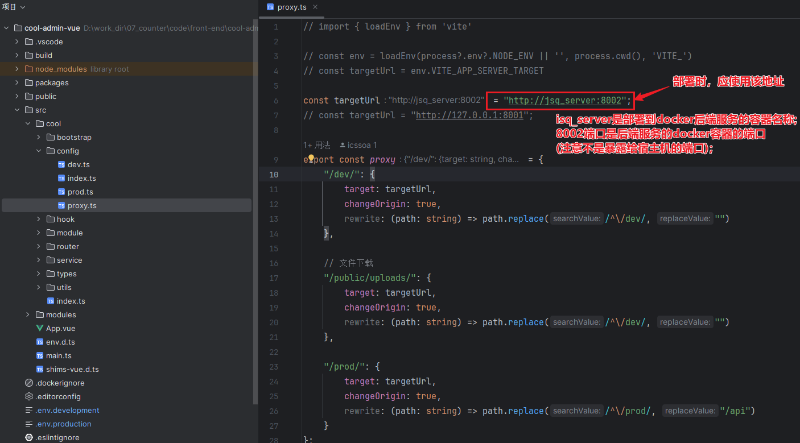
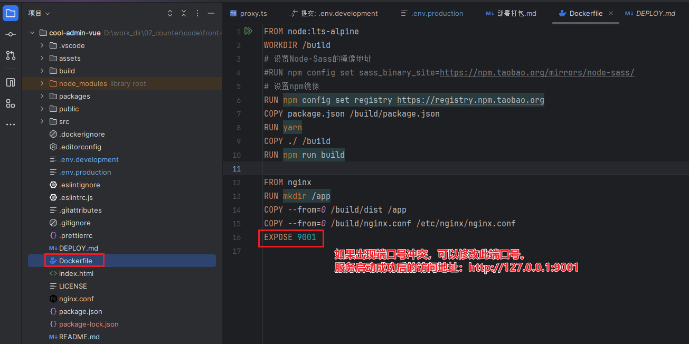
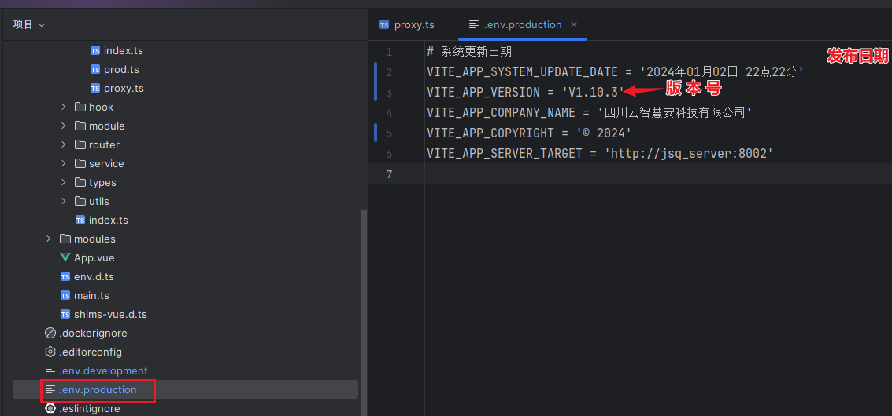
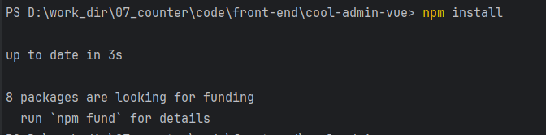
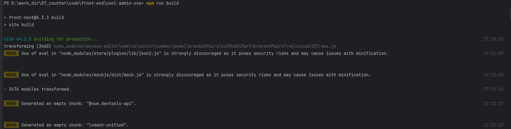
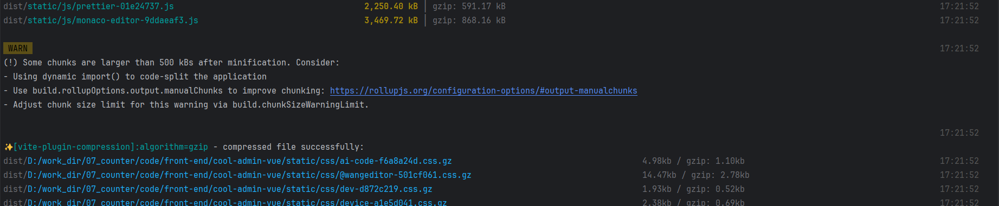
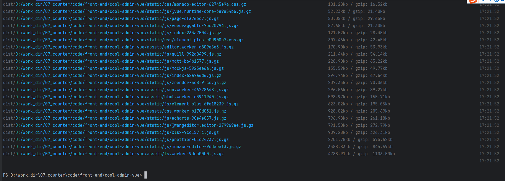
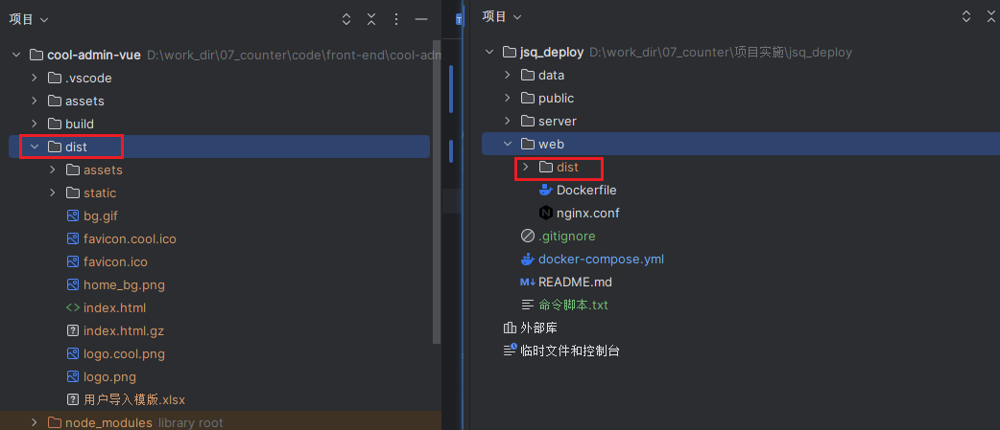

## 如何进行部署打包？

**进入项目后检查`src/cool/config/proxy.ts`该文件中的配置是否正确。**




**确认`./Dockerfile`文件中的端口号，默认`9001`**




**在`.env.production`该文件中修改发布日期和版本号**




**执行 `npm install` 命令安装项目依赖**




**执行 `npm run build` 命令编译打包**

```
npm run build
```








将打包生成的dist文件夹拷贝到 `/jsq_deploy/web/ `目录下




